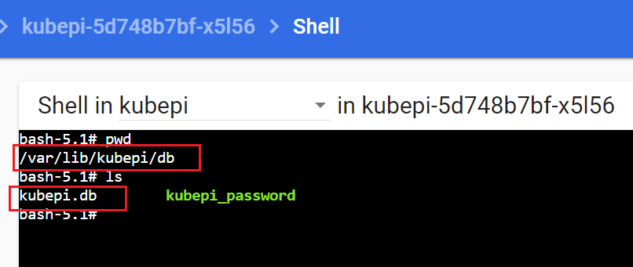
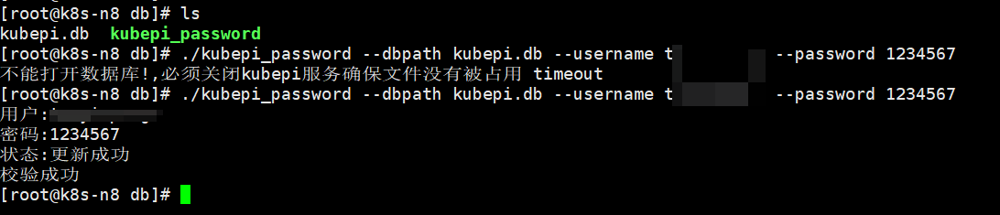

### kubepi密码重置工具
KubePi 是一个现代化的 K8s 面板。  
https://github.com/1Panel-dev/KubePi

kubepi重置其他用户密码需要提供原密码，没办法直接重置用户密码，在官方没有正式解决之前可以用此工具实现重置任意用户密码。

#### 安装
```shell
curl -o kubepi_password https://github.com/typ431127/kubepi_password/releases/download/1.0/kubepi_password
chmod + kubepi_password
```

#### 使用
因为kubepi使用的数据库比较特殊，所以使用前请关闭kubepi服务，否则会出现无法打开数据库文件的情况。

kubepi数据库目录/var/lib/kubepi
```shell
./kubepi_password --dbpath kubepi.db --username 用户名 --password 1234567
```

`kubepi数据目录`

`重置密码`
